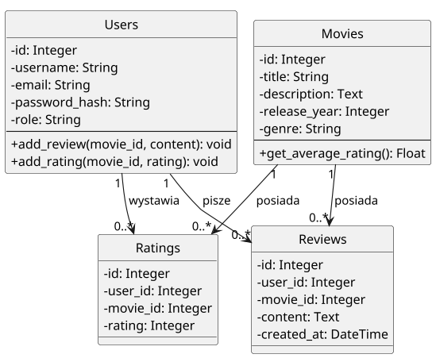
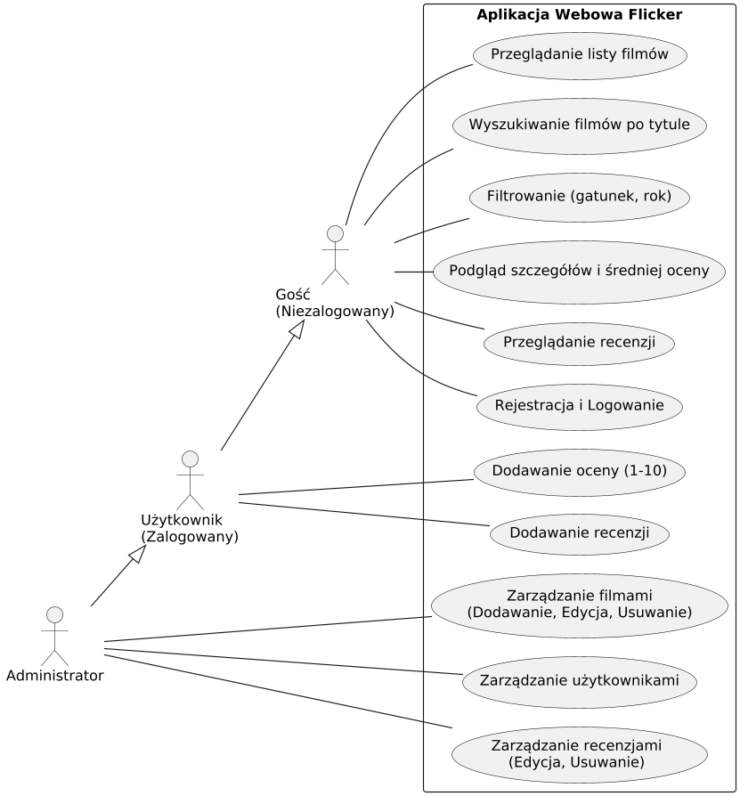
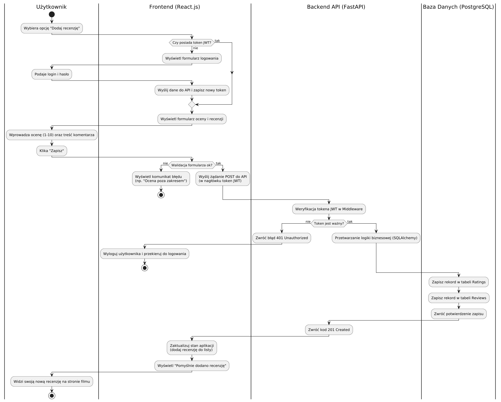
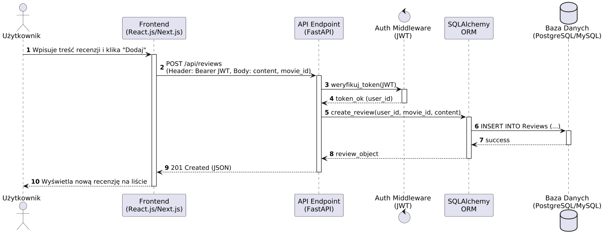
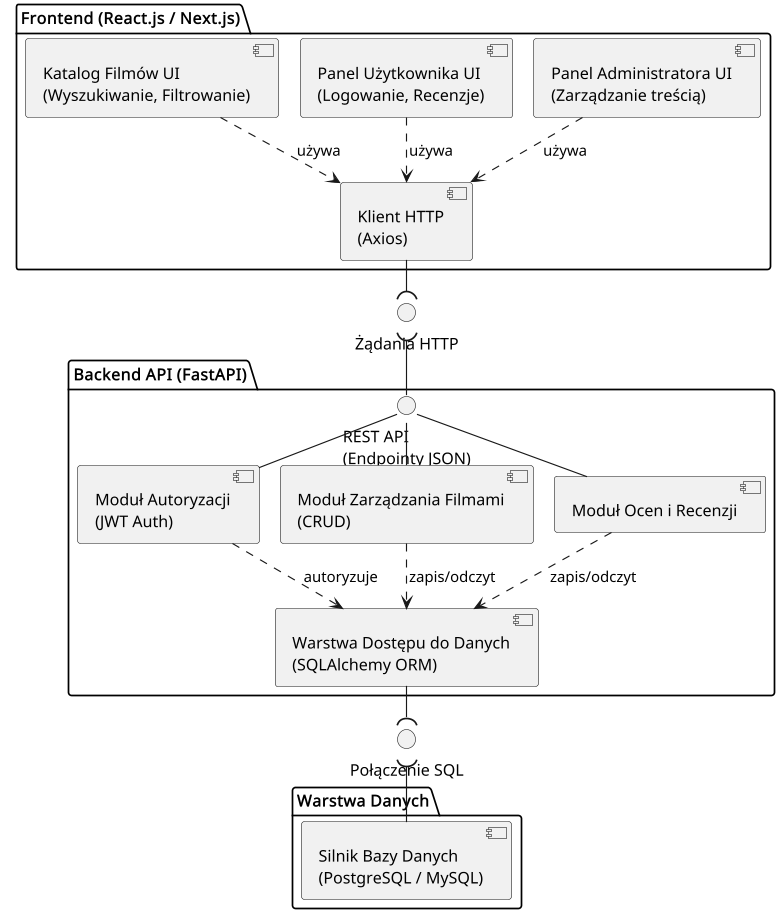
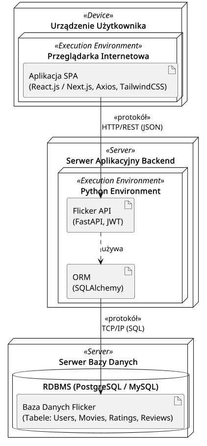

# Flicker - UML project

[Polski](README.md) | **English**

UML model of a web application for rating and reviewing movies (in the style of
Filmweb / IMDb). The repository contains a full set of UML diagrams together with
editable PlantUML sources and technical documentation of the system.

**Technology stack of the modeled system:** React.js / Next.js, FastAPI,
SQLAlchemy, JWT, PostgreSQL / MySQL.

## Scope of the model

The project describes a system with three roles (guest, logged-in user,
administrator), a layered architecture (frontend, API, database) and a relational
data model covering movies, users, ratings and reviews. The full description is in
[docs/dokumentacja.md](docs/dokumentacja.md) (Polish).

## UML diagrams

The diagrams are labeled in Polish; the descriptions below summarize what each one
shows.

### Class diagram

Data model: `Users`, `Movies`, `Ratings`, `Reviews` entities with their
attributes, methods and relationship multiplicities.



### Use case diagram

System features grouped by actor. Actor generalization is used: the administrator
inherits the logged-in user's permissions, and the logged-in user inherits the
guest's.



### Activity diagram

The flow of adding a rating and a review, split into swimlanes (user, frontend,
backend, database), with JWT authorization, form validation and error paths.



### Sequence diagram

Message exchange while adding a review - from the user interaction, through JWT
token verification, to the database write and the `201 Created` response.



### Component diagram

Layered structure of the system: frontend components, backend modules
(authorization, movie management, ratings and reviews, data access) and the
interfaces between layers.



### Deployment diagram

Runtime architecture: the user's device, the application server and the database
server together with the communication protocols.



## Repository structure

```text
.
├── README.md                 # Polish version
├── README.en.md              # this file
├── diagrams/                 # rendered diagrams (PNG)
├── src/                      # editable PlantUML sources (.puml)
└── docs/
    ├── dokumentacja.md       # technical documentation (Polish)
    └── Flicker.docx          # original document
```

## Generating the diagrams

The diagrams are generated from the PlantUML sources in [src/](src/).

Requirements: Java (JRE) and `plantuml.jar` downloaded from
[plantuml.com/download](https://plantuml.com/download) and placed in the
repository root. Run the command from the repository root:

```bash
java -jar plantuml.jar -tpng -o ../diagrams src/*.puml
```

No installation needed: the `.puml` files can also be pasted directly into the
online editor [plantuml.com](https://www.plantuml.com/plantuml).
