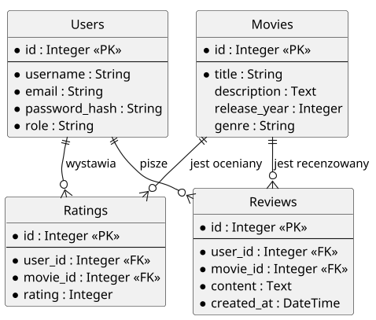
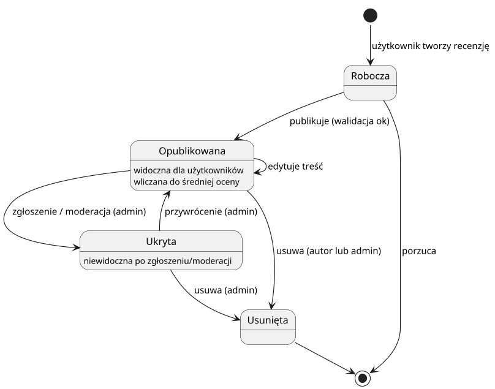

# Flicker - projekt UML

**Polski** | [English](README.en.md)

Modelowanie aplikacji webowej do oceniania i recenzowania filmów (w stylu
Filmweb / IMDb). Repozytorium zawiera komplet diagramów UML wraz z edytowalnymi
źródłami PlantUML oraz dokumentację techniczną systemu.

**Stos technologiczny modelowanego systemu:** React.js / Next.js, FastAPI,
SQLAlchemy, JWT, PostgreSQL / MySQL.

## Zakres modelu

Projekt opisuje system z trzema rolami (gość, zalogowany użytkownik,
administrator), warstwową architekturą (frontend, API, baza danych) oraz
relacyjnym modelem danych obejmującym filmy, użytkowników, oceny i recenzje.
Pełny opis znajduje się w [docs/dokumentacja.md](docs/dokumentacja.md).

## Diagramy UML

Osiem diagramów obejmujących wymagania, strukturę, dane, dynamikę i architekturę
systemu. Angielskie warianty znajdują się w [diagrams/en/](diagrams/en/).

### Diagram przypadków użycia

Funkcje systemu w podziale na aktorów. Zastosowano generalizację aktorów:
administrator dziedziczy uprawnienia zalogowanego użytkownika, a ten - gościa.


### Diagram klas

Model obiektowy: encje `Users`, `Movies`, `Ratings`, `Reviews` wraz z atrybutami,
metodami i licznościami relacji.


### Diagram związków encji (ERD)

Relacyjny model bazy danych w notacji kruczej stopki - klucze główne (PK), klucze
obce (FK) oraz liczności powiązań między tabelami.



### Diagram stanów

Cykl życia recenzji: od stanu roboczego, przez publikację i moderację, po
usunięcie.



### Diagram aktywności

Przepływ dodawania oceny i recenzji z podziałem na tory odpowiedzialności
(użytkownik, frontend, backend, baza danych), z obsługą autoryzacji JWT,
walidacji formularza oraz ścieżek błędu.


### Diagram sekwencji

Wymiana komunikatów podczas dodawania recenzji - od interakcji użytkownika,
przez weryfikację tokena JWT, po zapis w bazie i odpowiedź `201 Created`.


### Diagram komponentów

Warstwowa budowa systemu: komponenty frontendu, moduły backendu (autoryzacja,
zarządzanie filmami, oceny i recenzje, dostęp do danych) oraz interfejsy między
warstwami.


### Diagram wdrożenia

Architektura uruchomieniowa: urządzenie użytkownika, serwer aplikacyjny oraz
serwer bazy danych wraz z protokołami komunikacji.


## Struktura repozytorium

```text
.
├── README.md                 # ten plik (wersja polska)
├── README.en.md              # wersja angielska
├── LICENSE                   # licencja MIT
├── render.sh                 # regeneracja wszystkich diagramów
├── diagrams/                 # wyrenderowane diagramy PL (PNG)
│   └── en/                   # warianty angielskie
├── src/                      # edytowalne źródła PlantUML (PL)
│   └── en/                   # źródła PlantUML (EN)
├── docs/
│   ├── dokumentacja.md       # dokumentacja techniczna (PL)
│   ├── documentation.md      # dokumentacja techniczna (EN)
│   └── Flicker.docx          # oryginalny dokument
└── .github/workflows/        # CI: automatyczny render diagramów
```

## Generowanie diagramów

Diagramy są generowane ze źródeł PlantUML w katalogach [src/](src/) oraz
[src/en/](src/en/). Wymagania: Java (JRE) oraz `plantuml.jar` pobrany ze strony
[plantuml.com/download](https://plantuml.com/download).

Najprościej skryptem (regeneruje wersję polską i angielską):

```bash
./render.sh
```

Lub ręcznie, z katalogu głównego repozytorium:

```bash
java -jar plantuml.jar -tpng -o ../diagrams    src/*.puml
java -jar plantuml.jar -tpng -o ../../diagrams/en src/en/*.puml
```

Bez instalacji: pliki `.puml` można też wkleić bezpośrednio do edytora online
[plantuml.com](https://www.plantuml.com/plantuml).
